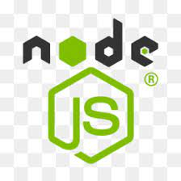

My Names Fahra, I'm a Full stack developer and I'm from Birmingham (UK).  
Im currently on the verge of completing my certification in full stack development with the University of Birmingham.

 
 
<h3 align="center" > Tools, languages, and other things that I like to work with.</h3>

<table align="center" >
  <tr>
    <td align="center" width="96">
        
       CSS
    </td>
    <td align="center" width="96">
        
       HTML
    </td>
    <td align="center" width="96">
        
       JQuery
    </td>
    <td align="center" width="96">
        
       JavaScript
    </td>
</tr>
<tr>
    <td align="center" width="96">
        
       MongoDB
    </td>
    <td align="center" width="96">
        
       NodeJS
    </td>
    <td align="center" width="96">
        
       React
    </td>
    <td align="center" width="96">
        
       MySQL
    </td>
  </tr>
  
</table>

 

<h3 align="center" > A bit about me...</h3>

🔭 &nbsp;I’m currently working on a super cool project related to the MERN stack (wish me luck!)  

👯 &nbsp;I’m looking to collaborate on full stack web apps!

 ⚡&nbsp; Fun fact: although i hate running... i ran a marathon!

 📫 &nbsp;How to reach me: [LinkedIn](https://www.linkedin.com/in/f-akhlaq/) or my [Personal web page](https://fudge88.github.io/react-portfolio/)

